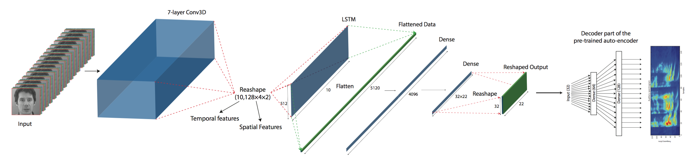

# LipReading

This is the keras implementation of *Lip2AudSpec: Speech reconstruction from silent lip movements video.* 



### Abstract
In this study, we propose a deep neural network for reconstructing intelligible speech from silent lip movement videos. We use auditory spectrogram and its corresponding sound generation method which preserves pitch information resulting in a more natural sounding reconstructed speech. Our proposed network consists of an autoencoder to extract bottleneck features from the auditory spectrogram which is then used as target to our main lip reading network comprising of CNN, LSTM and fully connected layers. Our experiments show that the autoencoder is able to reconstruct the original auditory spectrogram with a 98% correlation and also improves the quality of reconstructed speech from the main lip reading network.
Our model, trained jointly on different speakers is able to extract individual speaker characteristics and gives promising results of reconstructing intelligible speech with superior word recognition accuracy.

## Requirements
We implemented the code in python2 using tensorflow, keras, scipy, numpy, cv2, sklearn, IPython, fnmatch. The mentioned libraries should be installed before running the codes. All the libraries can be easily installed using pip:
```shell
pip install tensorflow-gpu keras scipy opencv-python sklearn
```
The backend for Keras can be changed easily if needed.

### Data preparation
This study is based on GRID corpus(http://spandh.dcs.shef.ac.uk/gridcorpus/). To run the codes, you need to first download and preprocess both videos and audios.

By running **_prepare_crop_files.py_** data will be downloaded and frames will be cropped by a manual mask. In order to generate auditory spectrograms, the audios should be processed by NSLTools(http://www.isr.umd.edu/Labs/NSL/Software.htm) using **_wav2aud_** function in Matlab.

Since some of the frames in the dataset are corrupted, we generate a path for valid data by **_create_path.py_**. Last step before training the network is windowing and integration of all data in **_.mat_** formats. This can be done by running **_data_integration.py_**

### Training the models
Once data preparation steps are done, autoencoder model could be trained on the auditory spectrograms corresponding to valid videos using **_train_autoencoder.py_**. Training the main network could be performed using **_train_main.py_**.

### Demo

You can find all demo files [here](demo/).

A few samples of the network output are given below:

**Sample 1**

[](https://youtu.be/Op7Z9KH5Fis "Sample1_s1")

**Sample 2**

[](https://youtu.be/O0Gfb-1lu2k "Sample2_s29")


